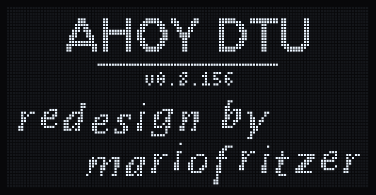
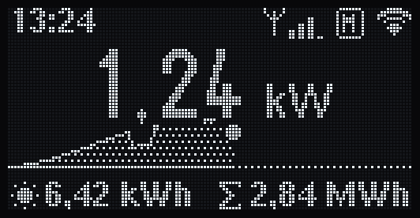
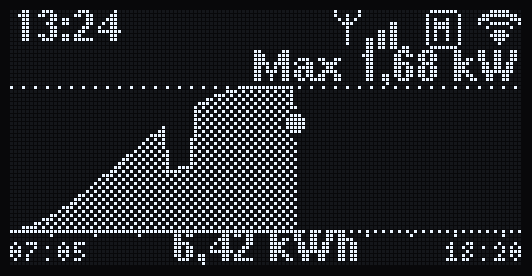
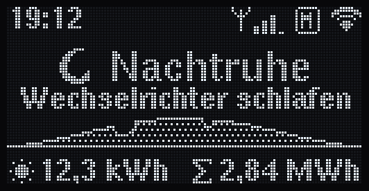
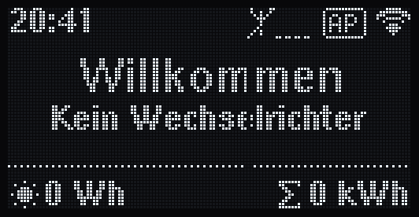
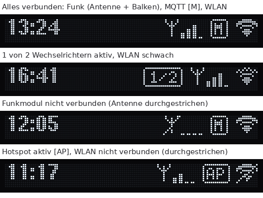
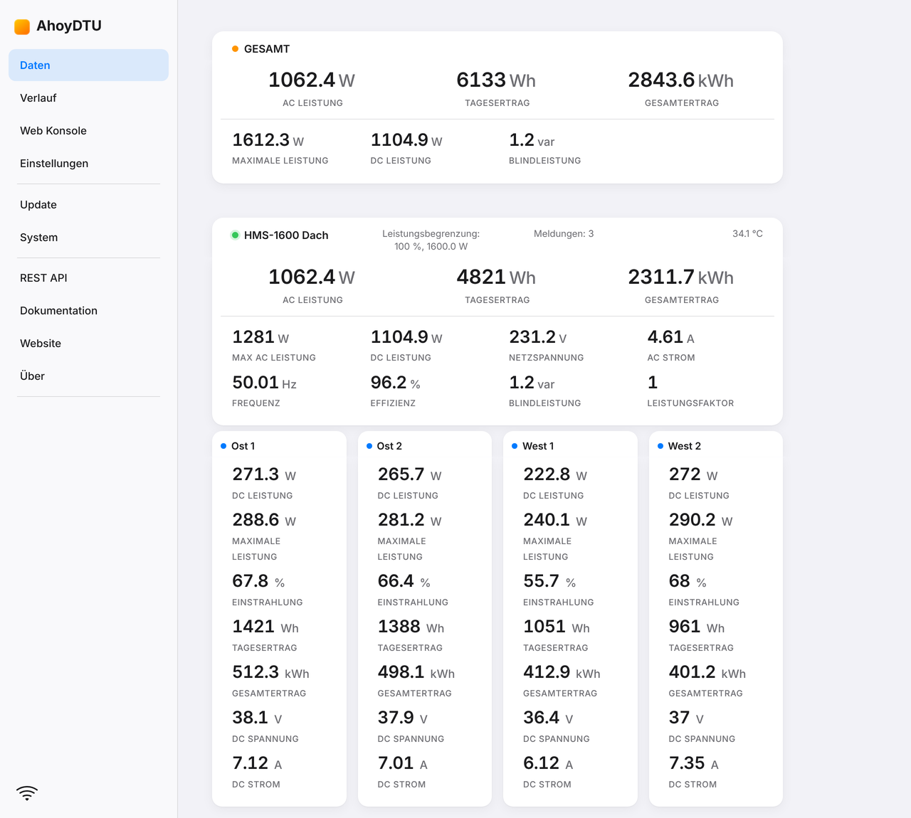
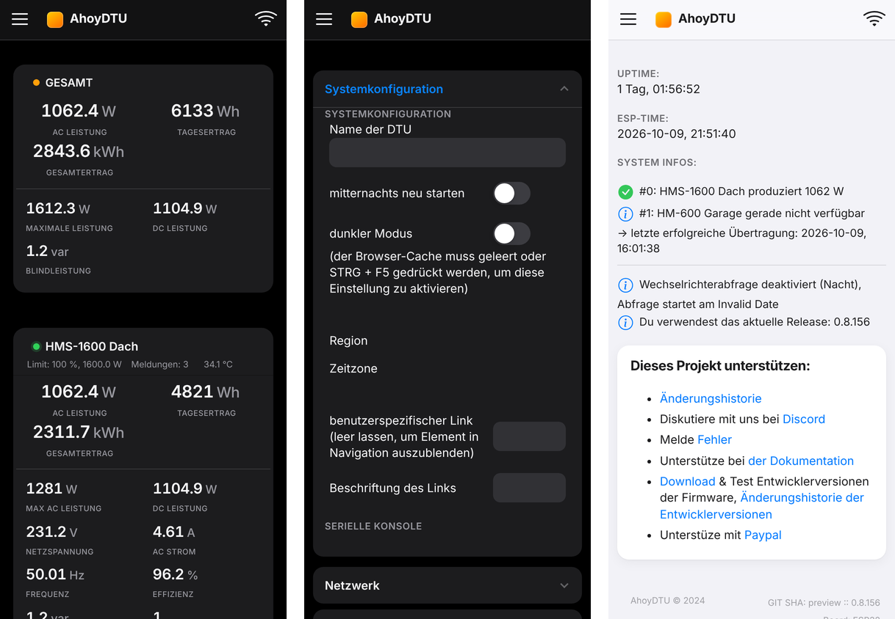
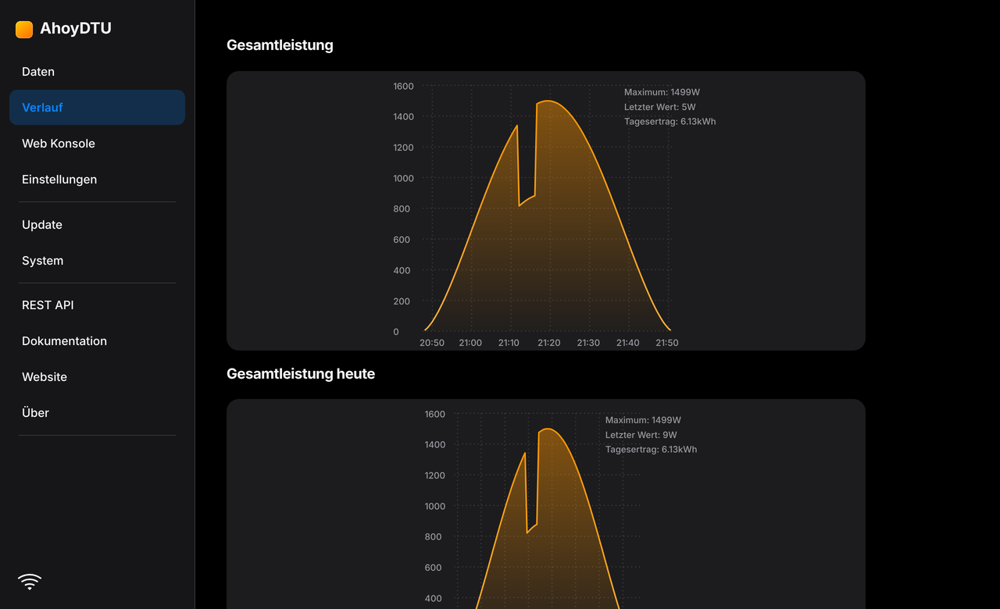

# ☀️ AHOY DTU – Redesign

**Ein modernes Redesign von [AhoyDTU](https://github.com/lumapu/ahoy)**: neue Grafik für das OLED-Display mit Tagesverlauf und eine neue Weboberfläche im iOS-Stil, mit hellem und dunklem Modus.

  

| | |
|---|---|
| **Basis** | AhoyDTU **0.8.156** (Release vom 12.08.2025) von [lumapu/ahoy](https://github.com/lumapu/ahoy) |
| **Redesign** | [mariofritzer](https://github.com/mariofritzer), Oktober 2026 |
| **Funktionsumfang** | wie AhoyDTU 0.8.156, nur Display und Weboberfläche sind neu gestaltet (Ausnahme: siehe [Unterschiede](#unterschiede-zum-original)) |
| **Hardware** | ESP32-WROOM-32, CMT2300A (HMS/HMT) oder NRF24L01+ (HM), OLED SH1106 / SSD1306 / SSD1309 128×64 |

---

## 📟 Display (128 × 64 OLED)

| Hauptseite | Tageskurve |
|:---:|:---:|
|  |  |
| Aktuelle Leistung groß, darunter die Tageskurve als Band, unten Tages- und Gesamtertrag | Kurve von Sonnenauf- bis -untergang mit Maximum und Uhrzeiten |
| **Nacht** | **Ohne Wechselrichter** |
|  |  |
| Wechselrichter schlafen, Kurve des Tages bleibt stehen | Willkommen-Bildschirm nach der Ersteinrichtung |

### Statusleiste

| Symbol | Bedeutung |
|---|---|
| Antenne + 4 Balken | Funkverbindung zu den Wechselrichtern, mehr Balken = bessere Verbindung |
| `[M]` | MQTT verbunden |
| `[AP]` | Hotspot ist wirklich aktiv (gestartet und erreichbar) |
| WLAN-Fächer | WLAN-Signal, gepunktete Bögen = schwach |
| `[1/2]` | nur ein Teil der Wechselrichter liefert gerade Strom |
| durchgestrichen | nicht verbunden (Funkmodul bzw. WLAN) |

Links oben wechseln **IP-Adresse und Uhrzeit** in einstellbarem Takt (siehe unten).

### Weitere Details
- Zahlen im deutschen Format (`1,24 kW`), große Ziffern, Einheiten automatisch (W/kW, Wh/kWh/MWh)
- Tageskurve mit Sonnenauf-/-untergang aus den Koordinaten. Ohne Koordinaten gilt 05:00–21:00.
- Die Ertragszeile überschneidet sich nie: Bei Platzmangel fallen erst die Nachkommastellen weg, dann wird die Schrift kleiner.
- Bildschirmschoner (Bildversatz) und Bewegungssensor funktionieren wie im Original

---

## 🌐 Weboberfläche

Neues, iOS-inspiriertes Design mit Karten, Schaltern, aufklappbaren Einstellungsgruppen und Diagrammen in Solar-Orange. Alle Funktionen sind unverändert.

> Der dunkle Modus wird unter *Einstellungen → Systemkonfiguration → dunkler Modus* eingeschaltet.

---

## ⚙️ Neue Einstellungen

Unter *Einstellungen → Display Konfiguration → Seitenwechsel*:

| Einstellung | Wirkung |
|---|---|
| **Anteil der Kurvenseite (0–100 %)** | Das Display wechselt im 15-s-Takt zwischen Hauptseite und Tageskurve. 0 = nur Hauptseite, 100 = nur Kurve, 30 = ca. 10 s / 5 s |
| **Wechsel IP / Uhrzeit (s)** | Statusleiste zeigt abwechselnd IP und Uhrzeit, beide gleich lang. 0 = nur Uhrzeit. Standard: 5 |

---

## ⬇️ Download & Installation (OTA)

1. Neueste Firmware von **[Releases → redesign-latest](https://github.com/mariofritzer/Ahoy_redesign/releases/tag/redesign-latest)** herunterladen:
   - `…_esp32-wroom32-de.bin` → deutsche Oberfläche
   - `…_esp32-wroom32.bin` → englische Oberfläche
2. **Vorher Einstellungen sichern:** *Einstellungen → Export*
3. In der Ahoy-Weboberfläche unter **Update** die `.bin` hochladen. Bei einem Wechsel zwischen deutscher und englischer Variante erscheint ein Hinweis, dann auf *Weiter* klicken.
4. Nach dem Neustart die Seite mit **Strg+F5** neu laden (Browser-Cache)

Zurück zum Original geht jederzeit per Update mit einer offiziellen Firmware von [fw.ahoydtu.de](https://fw.ahoydtu.de).

> Die Firmware bleibt automatisch geprüft unter der OTA-Grenze von 1.306.624 Bytes (Partition 0x140000 minus 4 KB), mit mindestens 8 KB Reserve.

---

## Unterschiede zum Original

- **Ethernet ist in den `esp32-wroom32`-Varianten deaktiviert**, um Speicher für das Update zu sparen. Die Standard-Pins des CMT2300A (SDIO 14, SCLK 12) überschneiden sich ohnehin mit dem Ethernet-SPI. Wer Ethernet braucht, nimmt die Original-Firmware.
- Die Option „Graph Position“ ist für 128×64-Displays ausgeblendet. Das neue Layout positioniert die Kurve selbst.

### Standard-Pins (esp32-wroom32)

| CMT2300A | GPIO | | NRF24L01+ | GPIO |
|---|---|---|---|---|
| CSB | 27 | | CS | 5 |
| FCSB | 26 | | CE | 17 |
| IRQ (GPIO3) | 34 | | IRQ | 16 |
| SDIO | 14 | | MISO / MOSI | 19 / 23 |
| SCLK | 12 | | SCLK | 18 |

---

## 🛠 Selbst bauen & Werkzeuge

- **Automatischer Build:** Jeder Push auf `main` oder `modern-ui` baut die Firmware über GitHub Actions ([Workflow](.github/workflows/build_redesign.yml)) und aktualisiert das Release `redesign-latest`.
- **Lokal:** VS Code + PlatformIO, Ordner `src`, Umgebung `esp32-wroom32-de`
- **Display-Vorschau am PC:** [`tools/display_preview`](tools/display_preview) rendert den echten Display-Code mit der u8g2-Bibliothek als Bilder.
- **Web-Vorschau:** [`tools/web_preview/server.py`](tools/web_preview/server.py) startet die Weboberfläche lokal mit Beispieldaten.
- **Icons:** [`tools/display_icons/make_icons.py`](tools/display_icons/make_icons.py) erzeugt die Display-Symbole aus Pixel-Art.

---

## 🙏 Credits & Lizenz

Dieses Projekt basiert vollständig auf **[AhoyDTU](https://github.com/lumapu/ahoy)** von lumapu und allen Mitwirkenden. Danke für die großartige Arbeit! Die originale Projektbeschreibung findest du in [doc/README_ahoy_original.md](doc/README_ahoy_original.md), Dokumentation unter [docs.ahoydtu.de](https://docs.ahoydtu.de).

Wie das Original steht auch dieses Redesign unter der
[Creative Commons Attribution-NonCommercial-ShareAlike 4.0 International License](https://creativecommons.org/licenses/by-nc-sa/4.0/deed.de). **Nicht-kommerzielle Nutzung**, Weitergabe nur unter gleichen Bedingungen und mit Namensnennung.

*Redesign by mariofritzer*
